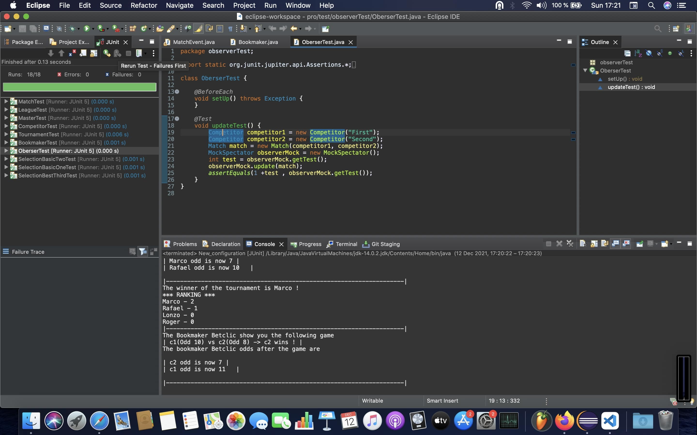
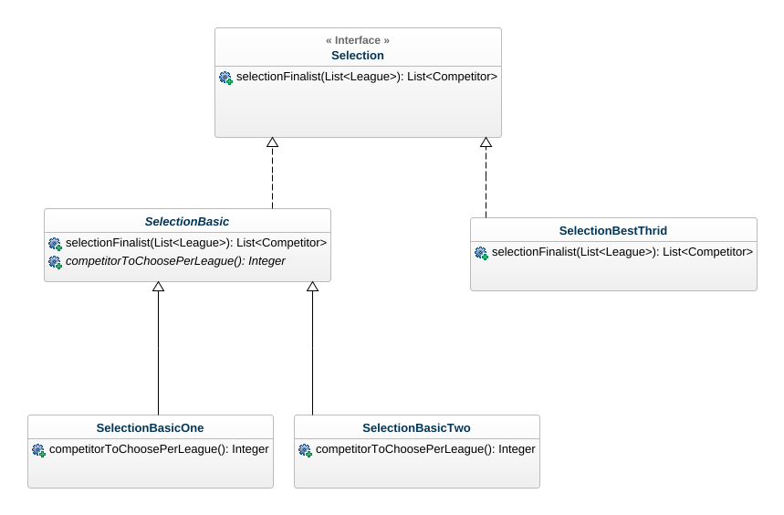
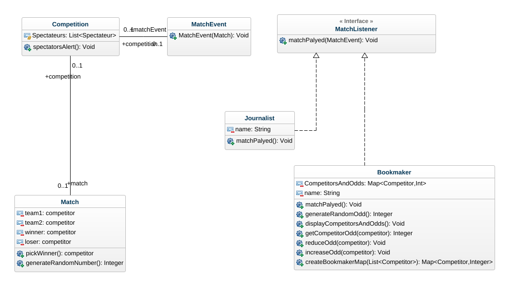
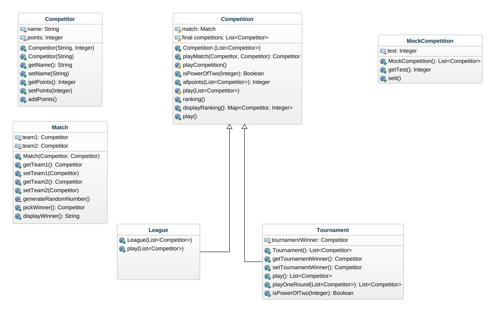
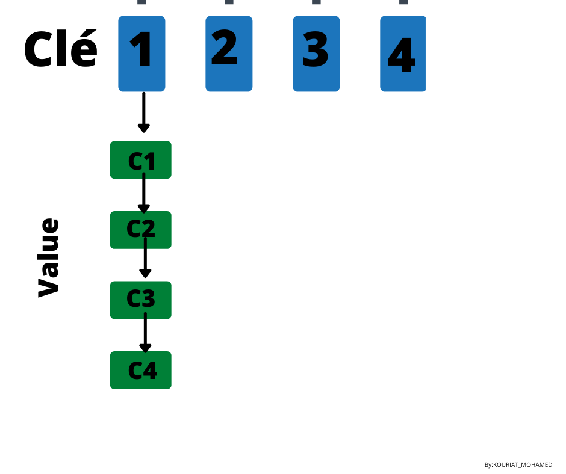

# Simulation_compétitions_sportives

# Equipe

- Mohamed Kouriat 
- Glenn Youbi Degnon

# Introduction 
Ce projet nous permet de mettre en oeuvre la gestion de différents de compétition telles que des leagues et des tournois avec un nombre de participants, dans notre cas competiteur, variées.
                             

# How to
###  Récupération du dépôt

1. Placez dans le git Kouriat_Youbi_COO_Project et clonez mle projet avec une clé SSH ou avec HTTPS selon votre souhait en copiant l'un des liens qui vous ait proposés.

2. Placez vous dans votre dans le répetoire de votre choix et entrez la commande : 

git clone <lien>

* Pour pouvoir exécuter les commandes suivantes placez dans la racine de votre répertoire.

3. Pour génerer les fichiers classes, executez la commande : 

   ``` make classes ```

4. Pour exécuter le tournoi lancez la commande : 

``` make tournament ```

5. Pour exécuter le tournoi lancez la commande : 

``` make league```

6. Pour exécuter le master lancez la commande : 

``` make master```

7. Pour génerer la documentation lancez la commande : 

``` make docs```

#####  Problème Majeur Rancontré
* !!! Exécution des tests hors Eclipse. Les tests compilent et s'exécute avec succès dans eclipse mais pas dans le terminal externe
   avec l'utilisation d'un jar Junit5 trouver sur internet. !!!

   * Execution des tests



#### Pour la compilation des fichiers du package *competition* :

# Elements de Conception

1. Utilisation de l'héritage dans les classes de tests liées aux classes *competition*, *League* et *Tournament*.

2. Utilisation du design pattern *Strategy* pour implémenter les classes de selection. Ce design pattern permet
   l'encapsulation de différentes classes de **selection** et permet l'adaption et l'implémentation de plusieurs
   autres classes de selection. Il a été utilisé pour permettre l'implétation de nouvelles méthodes de strategy sans avoir à modifier
   le code existant mais parce que il suffit simplement de créer une nouvelle qui implémente l'interface **selection** pour créer une
   nouvelle méthode pour selectionner les finalistes d'un master.

3. Design pattern *template* mise en place entre les classes **SelectionBasic** **SelectionBasicOne** **SelectionBasicTwo** défini par
   la méthode *competitorToChoosePerLeague* qui défine le nombre de compétiteurs à choisir pour la classe de selection. Ce pattern a été utilisé pour
   éviter de la duplication de code car les classes **SelectionBasicOne** **SelectionBasicTwo** implémente identiquement la méthode *selectionFinalist*
   à la difference près du nombre de competitor choisie par chacune.
 

 4. Mise en place du design pattern Observer, pour permettre l'inclusion d'observateurs lors du déroulement des compétitions. 
    Son utilisation se justifie par le, qu'il permet d'une part de créer n'importe quel type d'observer pour un événement donné et d'autre part
    il facilite l'ajout d'observer aux événements correspondant.
    Cela a rendu possible grâce à l'implémentation de classe *Event* et de classe *Listener* qui sont : *MatchEvent* et *MatchListener*
    Dont MatchListener est une interface d'écoute et dont le comportement est mise à jour l'excution d'un match.
    Cette interface est peut être implémenter par tous types d'observer (ou d'abonnés).

    

 
# Livrables

## UML FINALE




## Livrable 1


Mise en place et implémentation des classes Match, Competitor, Competition, League et Tournament.


### Atteinte des objectifs

1. Le déroulement des tournament est complet.
2. Le déroulement des league est complet. 
3. Le déroulement des master est complet.
4. Les observateurs des compétitons réagissent après le déroulement de chaque match.

### Difficultés restant à résoudre

1. Aucunes difficultées restantes.

## Livrable 2 

Ajout d'un nouveau de compétition **Master** qui est une compétition se déroulant en phase de poules et en phase final.
La phase de poules correspond à un enchainement successifs de plusieurs league qui se joue les unes après les autres.
La phase final correspond au déroulement d'un Tournament dont les participants sont les competiteurs issus de la phase de poules.

### Atteinte des objectifs

1. Exécution du Master avec classes de selection.
2. Implémentation de plusieurs classes de selection

### Difficultés restant à résoudre

1. Factorisation des tests de selection pour supprimer la duplication de code.
2. Exécution des tests hors Eclipse. Les tests compilent et s'exécute avec succès dans eclipse mais pas dans le terminal externe
   avec l'utilisation d'un jar Junit5 trouver sur internet.

## Livrable 3

  ### Modification 

  1. Ajout des attributs *loser* and *winner* dans la classe **Match** .

  2. Modification de la méthode *pickWinner* dans la classe **Match**, la fonction renvoie toujours le gagnant du match et de plus 
  elle mets à jour *les attributs loser et winner* de la classe en attribuant le gagnant du match à l'attribut winner et le perdant à l'attribut loser.
  
  3. Ajout d'un attribut *List<MatchListener>* qui représente les objets qui assistent à la compétition et sont mis à jour après le déroulement de chaque match.

  4. Ajout d'un second *constructeur* dans la classe **Competition** qui permet de créer une compétition avec une liste de *spectator* .

  ### Nouveautés

  1. Ajout d'une classe  **MatchEvent** qui une classe d’ ́evénenements qui permet de gérer les évenements émis par le générateur d'evénements, dan
  notre cas les matches qui se déroulent lors des compétitoins.

  2. Ajout d'une interface  **MatchListener** qui représente les personnes assistants au match et dont le comportement est mis à jour après le déroulement
  de chaque match de la compétition.

  3. Ajout d'une classe **Journalist** qui implémente l'interface **MatchListener** et réagit comme un observateur. 

  4. Ajout d'une classe **Bookmaker** qui implémente l'interface **MatchListener** et réagit comme un observateur. 

  ### UML Livrable 3

Nouveautés du Livrable 3.
=========================
   
   

  ### Tests Livrable 3

Tests du Livrable 3.
=========================

   

# Journal de bord

## Semaine 1

1.Premiere version de UML
2. Initilisation des classes "Match", "Competitor", "Competition" .
3. Completer la CLass Competiton

## Semaine 2
1. update Uml
2. Update Competition 
3. créé les Classe Tournoi et Match 

## Semaine 3
1. update Classe Tournoi & Match 
2. update Uml
3. Création des Classe League & competitor

## Semaine 4 
1. Modification classe Competition
2. update classe league Competitor
3. faire les Test  pour les Classe 
4. Executer le Programme a travers eclipse 
5. faire le Makefile

La compétition est responsable de l’organisation de ses matchs.  c’est elle qui fait :

jouer ses matchs --> La methode play() déroule donc une compétition jusqu’a  tous les matchs ont été joués et qu’un Winner est désigné.

Donc  faire jouer successivement chaque match de la compétition selon les règles du cahier de charge ( gangnant +1 , perdant 0 , le nombres des équipe et multipe de  2 .

## Semaine 5
1. Initialiser la Classe Master 
2. Faire la Premiére Analyser  
### Premiére Analayse    

On a un Algorithme qui fait La Selection des Competitors , la Premiére Selection Prends 4 Competitors et la deuxieme Selction Prends 8 Competitors Alors pour éviter d'adaptant l’application chaque fois On préfere  Utiliser  **Le patron de conception  stratégie** qui propose de Décomposer  l'algorithmes en classes séparées .

3. Utilisation de HashMap pour les Phase de Poules Pour réduire le time d'execution et Chaque Noeud = une League 


## SEMAINE 6

1. Mise à jour de la classe league et league: modification de la sginature de la méthode play de la classe League.
2. Défintion de la classe d'exception HensCompetitorsException pour définir une exception sur le nombre de poules et le nombre
    de competitors d'un Master.
3. Mise à jour de la classe Master, ajout de la fonction buildHens qui initialise un le nombre de poules d'un master.
4. Initialisation des tests pour la classe Master.
5. Misa à jour de la classe MasterTest. Nouveautés : ajout du test playHensTest, pour tester la méthode playHens initialiser dans la classe Master.
6. Update de la classe Master ajout des methodes playHens et selectionFinalists, pour permettre l'exécution des phases de poules.
7. Ajout de l'affichage dans les methodes playHens et playFinaLPhase pour permettre de distinguer les phases en cours d'exécution.
8. Ajout du class abstraite selectionBasic qui permettra d'implémenter plusieurs filles dont l'objectif est de choisir les n premiers competitors de chaque poules du Master, utilisation du template pattern pour éviter de la duplication de code dans chaque classe fille.

# Internet ressources 

1. Fonction generateRandomNumber et generateRandomNumnber 
```java 
private int generateRandomNumber() {
		int max = 10;
		int min = 0;
		int randomNumber = min + (int)(Math.random()* (max - min)) - max;
		return randomNumber;
	}

private int generateRandomOdd() {
		int max = 11;
		int min = 1;
		int randomNumber = min + (int)(Math.random()* (max - min)) - max;
		return (-1)*randomNumber;
	}


   
```
Lien :  ... [Lien de documentation pour les fonctions generate](https://dzone.com/articles/random-number-generation-in-java).


2. Fonction isPowerOfTwo 
```java 

	/**
  *This is the function that checks if a number is a multiple of 2.
  *@param n the number on which have checked.
  *@return if it is pow of 2.
  */
	 public boolean isPowerOfTwo(int n){

    return (n != 0) && ((n & (n - 1)) == 0);
  }
   
```

Lien :  ... [Lien de documentation pour les fonctions generate](https://qastack.fr/programming/600293/how-to-check-if-a-number-is-a-power-of-2).